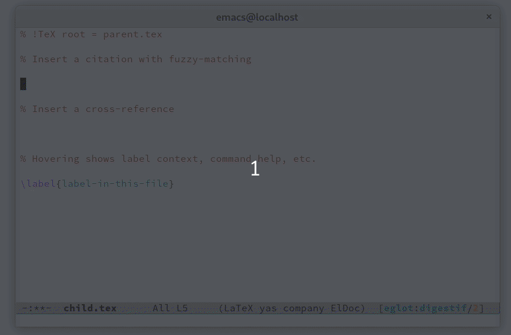

# Digestif

A [Visual Studio Code](https://code.visualstudio.com) extension that provides rich editing support for the
[LaTeX](https://www.latex-project.org) and [ConTeXt](https://www.contextgarden.net/) typesetting system powered by the [digestif](https://github.com/astoff/digestif) language server.
It aims to produce high quality code completion results by indexing your used packages as you type.

